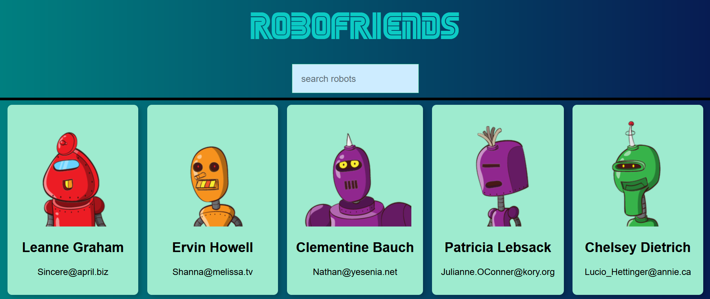

# Robo Friend App

This simple React app allows you to filter through a list of friendly robots, each one waiting to be your friend!

## How to Use

1. Clone or download this repository.
2. Install dependencies using `npm install`.
3. Run the app with `npm start`.
4. Use the search bar to filter through the robot friends by name.

## Screenshots

## Technologies Used

- React
- JavaScript
- HTML5
- CSS3

## Credits

This app was created by Muhammad Rebaal as a part of a React learning project.

Feel free to contribute and enhance the features!
